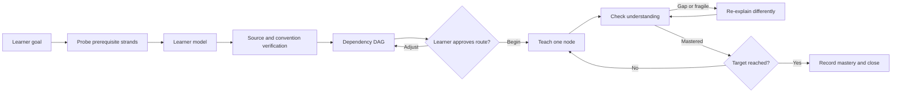

# Replicate the Pi Adaptive-Learning Agent Workflow in OMP

This guide reproduces the workflow demonstrated in [How I Use AI to Learn Things](https://youtu.be/kzcI5F4tGiU) using project-local OMP features. It does not modify `~/.omp`, install an extension, or change the local OMP installation.

The implementation uses:

- one project-local `teach` skill;
- OMP's built-in interactive `ask` tool for adaptive quizzes;
- OMP's `task` tool and two project-local subagent definitions for fact-checking and visuals;
- Mermaid for the dependency plan;
- ordinary Markdown files for the durable lesson artifact and optional Obsidian UI;
- OMP's `read`, `web_search`, `browser`, and image-inspection capabilities for source and visual verification.

## Attribution

The original workflow demonstration is Eero Alvar's video, [How I Use AI to Learn Things](https://www.youtube.com/watch?v=kzcI5F4tGiU). Credit for the demonstrated Pi workflow and teaching process belongs to Eero Alvar.

This repository is an independent OMP adaptation based on the video's observable behavior. It is not affiliated with or endorsed by Eero Alvar or the Pi project. The video's custom Pi files, including `md-log.ts`, are not copied here. Downloaded video, captions, and review frames were used only for analysis and are intentionally excluded from the repository.

## 1. What the video actually implements

The downloaded source is an 18:58, 1920x1080 video with English Google auto-generated captions. Transcript and frame review show this workflow:

| Time | Observed behavior | Invariant to preserve |
|---|---|---|
| 04:22-05:13 | Optimize teaching and move logistics away from the learner. Difficulty remains in the subject itself. | Do not make the material artificially easy; remove planning, source-finding, verification, and sequencing overhead. |
| 05:18-06:03 | Probe the learner with graded multiple-choice questions. Begin broadly, then move harder or easier to find the knowledge boundary on every prerequisite strand. | Build an evidence-based learner model before planning. Self-report alone is insufficient. |
| 06:03-06:53 | Plan only after probing. Launch a fact-checking subagent and force the route into a Mermaid dependency graph. | Verification establishes trust; the graph forces explicit dependency reasoning rather than improvised teaching. |
| 06:56-08:00 | Teach according to the learner's preferred style and periodically quiz for feedback. | The loop must recalibrate both the learner and the teacher. |
| 08:08-08:35 | Pi runs from a dedicated learning directory with `.pi/agents`, `.pi/extensions`, and `.pi/skills`. | Use project-local OMP equivalents so the workflow travels with the learning workspace. |
| 09:25-10:05 | A Markdown note is linked to the session, the `teach` skill is loaded, and the learner states a target rather than requesting a generic explanation. | Every session needs a concrete destination and a durable artifact. |
| 10:12-12:07 | The system asks adaptive prerequisite questions, accepts notes/reasoning, reveals grading, and changes question direction. | Ask one adaptive question at a time; do not batch a fixed quiz. |
| 12:30-13:04 | A background researcher checks definitions, conventions, and target claims against external sources. The teacher then presents a tailored route and dependency map. | Research validates the route; it does not replace learner-aware pedagogical design. |
| 13:04-13:20 | The learner approves the plan before teaching starts. | Keep an explicit human gate between planning and teaching. |
| 13:20-14:00 | A visualization skill delegates SVG creation. The subagent renders the SVG, inspects it, edits it, and inspects it again. | A generated visual is not complete until it has been rendered and visually checked. |
| 14:00 onward | The teacher advances one reasoning step at a time, connects each step to known material, and checks understanding before building on it. | Never dump the whole lesson. Advance only on demonstrated understanding. |

The core architecture is therefore:



## 2. Pi-to-OMP mapping

| Pi component visible in the video | OMP replacement |
|---|---|
| `.pi/skills/teach` | `<workspace>/.omp/skills/teach/SKILL.md` |
| Quiz extension | Built-in interactive `ask` tool |
| Researcher subagent | Project agent `.omp/agents/lesson-researcher.md`, dispatched with `task` |
| SVG-making subagent | Project agent `.omp/agents/lesson-visualizer.md`, dispatched with `task` |
| Web fetch/search extensions | `read` for known URLs and `web_search` for discovery |
| SVG render-and-review tools | `browser` screenshot followed by native image reading or `inspect_image` |
| Mermaid plan in Pi/Obsidian | A fenced `mermaid` block; OMP renders terminal Mermaid and Obsidian renders the note |
| Markdown logging extension | The skill owns and incrementally updates a structured Markdown lesson note |
| Obsidian as lesson UI | Open the same workspace, or only its `learning/` directory, as an Obsidian vault |
| Pi's subagent pane | OMP Agent Hub, opened with `Alt+A` |

A literal transcript mirror is not required for the learning contract. A structured note is better: it records goals, evidence, verified sources, the plan, completed teaching nodes, learner answers, and unresolved gaps without copying internal tool chatter. OMP's normal session remains the complete interaction record.

## 3. Project-local layout

Create these files in the learning workspace, not under the user home directory:

```text
<workspace>/
├── .omp/
│   ├── agents/
│   │   ├── lesson-researcher.md
│   │   └── lesson-visualizer.md
│   └── skills/
│       └── teach/
│           └── SKILL.md
├── learning/
│   └── assets/
└── OMP-PI-LEARNING-WORKFLOW.md
```

Commands to create only the directories:

```bash
mkdir -p .omp/agents .omp/skills/teach learning/assets
```

OMP discovers project skills at `<ancestor>/.omp/skills/*/SKILL.md` and project agents at the nearest `.omp/agents/*.md`. Run OMP from `<workspace>` so it resolves the intended project configuration. Project definitions override same-named user or bundled definitions, so the names below deliberately avoid bundled names.

## 4. Add the source-verification agent

Create `.omp/agents/lesson-researcher.md`:

```md
---
name: lesson-researcher
description: Verify a proposed lesson route, definitions, conventions, and target claims against authoritative external sources.
tools:
  - read
  - web_search
read-summarize: false
---

You are the source-verification worker for an adaptive one-to-one lesson.

Your input contains the learner's goal, the measured learner model, a candidate dependency route, and claims or conventions that need checking.

Do this:

1. Verify each load-bearing definition, theorem, formula, historical claim, convention, and prerequisite relation.
2. Prefer primary sources, official documentation, textbooks or university notes, standards, and original papers. Use secondary sources only to locate or corroborate primary material.
3. Open known URLs with `read`; use `web_search` only when the source URL is not already known.
4. Distinguish mathematical or domain conventions from invariant facts. State which convention the lesson should use and what changes under alternatives.
5. Identify missing prerequisites, circular dependencies, claims that are too strong, and facts that could not be verified.
6. Do not design teaching prose and do not widen the requested lesson. Audit the proposed route.

Return concise Markdown with exactly these sections:

## Route audit
For every route node: `verified`, `revise`, `remove`, or `unverified`, followed by the evidence-based reason.

## Canonical formulations
The exact definitions, statements, notation, units, assumptions, or version constraints the teacher should use.

## Prerequisite corrections
Only missing, misplaced, or unnecessary dependencies.

## Sources
A bullet list of descriptive source names and direct URLs. Associate each source with the claim it supports.

## Residual uncertainty
Anything that remains unverified or depends on a disputed convention. Never turn absence of evidence into approval.
```

Why this is separate from the teacher:

- external research consumes context;
- the worker can focus on source quality rather than lesson pacing;
- the main teacher retains the learner model and owns the route;
- a compact audit is easier to review than raw search results.

The teacher must still inspect the returned evidence. A subagent's `verified` label is not itself proof.

## 5. Add the render-inspect-revise visual agent

Create `.omp/agents/lesson-visualizer.md`:

```md
---
name: lesson-visualizer
description: Create one pedagogically necessary SVG, render it, inspect the rendered result, and revise visual defects.
tools:
  - read
  - write
  - edit
  - browser
  - inspect_image
---

You create one visual for one node of an adaptive lesson. The parent supplies:

- the exact concept and learning purpose;
- what the learner already understands;
- required labels, relationships, and notation;
- the exact target `.svg` path;
- the lesson note's background or theme constraints.

Rules:

1. Create only the requested SVG. Do not edit the lesson note or unrelated files.
2. Prefer a clean explanatory diagram over decoration. Every shape, arrow, color, and label must carry instructional meaning.
3. Use a `viewBox`, legible text, sufficient contrast, explicit arrow markers, and no clipped labels. Avoid `foreignObject`, external fonts, remote images, animation, and scripts.
4. Keep formulas and notation consistent with the supplied verified convention.
5. Write the SVG to the exact target path.
6. Open the SVG in `browser` using a `file://` URL and capture a screenshot.
7. Inspect the screenshot with native image reading when available; otherwise use `inspect_image`. Check geometry, directionality, proportions, label correctness, overlap, clipping, contrast, and whether the image teaches the requested relationship.
8. Correct every observed defect with `edit`, render again, and inspect again. At least one actual rendered inspection is mandatory.
9. Return the final SVG path, concise alt text, and a one-sentence account of what was visually checked. Never claim visual verification if the render or inspection failed.

Do not spawn another agent. Do not return an unrendered draft as complete.
```

The agent leaves the SVG as the durable asset. The temporary browser screenshot is only evidence for the inspection loop. SVG is appropriate here because it stays sharp in Obsidian, supports mathematical labels, and remains editable.

## 6. Add the adaptive `teach` skill

Create `.omp/skills/teach/SKILL.md` with the following content:

```md
---
name: teach
description: Run a source-verified adaptive lesson using probe, plan, learner approval, one-node teaching, and repeated mastery checks.
---

# Adaptive one-to-one teaching

This skill explicitly requires the `lesson-researcher` and, when a visual is genuinely useful, `lesson-visualizer` project agents.

## Contract

Optimize for one learner and one concrete goal. Keep productive difficulty in the subject. Absorb the logistics of prerequisite discovery, sequencing, source verification, and artifact maintenance.

Never:

- produce a generic full-course dump;
- infer mastery from familiarity, agreement, or the learner saying an explanation makes sense;
- reveal a quiz answer through option wording, descriptions, ordering cues, or `recommended` defaults;
- move to a dependent node after a wrong, guessed, or unexplained answer;
- claim that facts or visuals were verified when the corresponding check failed;
- bury unresolved uncertainty;
- replace the learner's requested target with a broader topic.

## Invocation and defaults

Extract these fields from the skill arguments:

- `Topic`: subject to learn.
- `Goal`: observable target understanding or capability.
- `Known`: optional self-reported background.
- `Style`: optional `intuition-first`, `formal-first`, or `mixed`.
- `Note`: optional Markdown path.

If `Topic` or `Goal` is missing, ask one concise clarification before doing anything else. Do not ask for fields that the invocation already supplies.

Default note path: `learning/<topic-slug>.md`.
Default asset directory: `learning/assets/<topic-slug>/`.

Never overwrite an existing note. Append a new dated `## Session` section and preserve all prior learner evidence. When creating a note, use this structure:

# <Topic>

## Goal

## Learner model

## Verified sources and conventions

## Plan

## Lesson

## Mastery ledger

## Unresolved questions

## Session close

Use `todo` to track these phases: probe prerequisites; verify and plan route; teach dependency nodes; record mastery and close. Do not treat todo completion as learner mastery.

## Phase 1: probe

Purpose: locate the learner's knowledge edge on every prerequisite strand required by the goal.

1. Parse the goal into a tentative prerequisite graph. This is a hypothesis, not the lesson plan.
2. Treat `Known` as a prior. Test its load-bearing parts.
3. Ask one adaptive question at a time with the interactive `ask` tool. The next question must depend on the last answer.
4. Start with broad anchor concepts. On a correct answer with sound reasoning, move harder or downstream. On a wrong or uncertain answer, move easier or test the prerequisite beneath it.
5. Cover each independent dependency strand. Stop based on boundary coverage, not a fixed quiz length. Five to twelve questions is common; sparse starting context may require more.
6. Each diagnostic question must:
   - test one concept;
   - have one defensible answer under the stated convention;
   - use two to five plausible options, including an explicit `I don't know` option when appropriate;
   - avoid trick wording and correctness cues;
   - omit `recommended`;
   - invite a short reasoning note when the UI supports it.
7. Grade immediately. During probing, give only the result and the smallest explanation needed to disambiguate the concept; do not begin the full lesson accidentally.
8. Classify every relevant concept as `mastered`, `fragile`, `gap`, or `unprobed`. Record the answer evidence, not just the label.
9. If recognition could mask weak understanding, ask for a prediction, calculation, comparison, or free-form explanation in normal chat before marking the concept mastered.
10. Update the note's `Learner model` after the probe. Include strengths, gaps, fragile areas, misconceptions, and evidence.

After content probing, use `ask` to resolve any still-unknown pacing or teaching preference. Do not ask again if the invocation already specified it.

## Phase 2: verify and plan

1. Construct the minimal candidate route from measured knowledge to the exact goal. Exclude already-mastered nodes except as anchors. Exclude interesting material that is not a dependency.
2. Dispatch `lesson-researcher` with `task`. Supply:
   - the exact goal;
   - the learner-model evidence;
   - the candidate route and edges;
   - all load-bearing definitions, formulas, conventions, and claims;
   - a requirement for direct source URLs.
3. The research task is read-only and does not need workspace isolation. While it runs, refine the dependency logic, but do not publish the plan as verified.
4. Before presenting the plan, integrate the audit. Correct rejected claims and dependencies. If the worker failed, perform the same verification with `web_search` and `read`; never silently skip verification.
5. Record canonical conventions and source URLs in `Verified sources and conventions`. Label residual uncertainty explicitly.
6. Present a plan containing:
   - a short approach tailored to the measured learner model;
   - an ordered list of the major conceptual moves;
   - a Mermaid dependency DAG;
   - for each unresolved node: why it exists, prerequisites, teaching move, and mastery check;
   - a clear target node.
7. The Mermaid DAG must distinguish mastered anchors, unresolved nodes, and the target. Every edge means a real prerequisite relation. Avoid decorative edges.
8. Write the same plan to the note.
9. Stop at an approval gate using `ask` with choices equivalent to:
   - `Begin this route`;
   - `Adjust dependencies or order`;
   - `Change depth or teaching style`.
10. If the learner requests adjustment, revise the plan and show the new graph before teaching. Approval is not optional.

## Phase 3: teach one node at a time

For each approved unresolved node:

1. State where the node sits in the dependency map and why it is the next step.
2. Teach exactly one conceptual move. Connect it to a mastered anchor or the immediately preceding node.
3. Give one concrete example, derivation, counterexample, or application appropriate to the topic.
4. Use a visual only when spatial structure, transformation, geometry, state, or comparison is materially clearer as an image. Do not generate decorative visuals.
5. For a useful visual, dispatch `lesson-visualizer` with:
   - one concept and learning purpose;
   - verified notation and facts;
   - what the learner already understands;
   - exact target path under the asset directory;
   - required labels and relationships.
   Do not request isolation because the final SVG must be written into the shared lesson workspace. The visual agent must not edit the note.
6. Embed the returned SVG in the note with descriptive alt text only after the render-inspect-revise loop succeeds.
7. Ask a mastery check before advancing. Prefer generation or application over recognition when practical. Multiple-choice checks use `ask` without `recommended`; open derivations or explanations use normal chat.
8. Interpret the answer:
   - `mastered`: correct plus reasoning or transfer evidence; mark the node complete and continue;
   - `fragile`: correct but guessed, cue-dependent, or poorly explained; give a contrasting example and recheck;
   - `gap`: wrong or `I don't know`; identify the misconception, re-explain with a different representation, then ask a smaller check;
   - `question`: answer the learner's interruption fully, update the learner model, and resume only when the dependency is stable.
9. Never repeat the same failed explanation verbatim. Change representation: verbal to visual, concrete to formal, example to counterexample, or forward reasoning to reverse reasoning.
10. Periodically ask a cumulative application question that combines prior nodes. Local success is insufficient if dependencies do not compose.
11. After each completed node, append to `Lesson` and update `Mastery ledger` with:
    - concept;
    - explanation or example used;
    - learner response;
    - evidence for status;
    - remaining uncertainty.
12. Keep chat pacing slow. One reasoning step and one check at a time.

## Phase 4: close

Close when the target is demonstrated or when the learner explicitly stops.

Record and report:

- the original goal;
- nodes mastered, each with evidence;
- fragile or missing nodes;
- verified conventions and sources actually used;
- the current location in the dependency graph;
- the next recommended node if the target is incomplete;
- unresolved learner questions.

Describe mastery as demonstrated capability, not material merely shown. Keep the note usable as the next session's `Known` input.
```

## 7. Start and invoke the workflow

Skills are discovered at startup. After creating the three files, exit any already-running OMP session and start OMP from the workspace root:

```bash
cd <workspace>
omp
```

Use an interactive TUI session. The `ask` tool is intentionally unavailable in headless mode because it requires a live user interface.

Choose a capable main model before starting; the video correctly notes that model intelligence affects teaching quality. The provided agents omit a hard-coded model selector, so OMP falls back to the parent session's active/default model. This is safer than embedding provider-specific model IDs in a portable workflow.

Invoke the skill with a concrete target:

```text
/skill:teach Topic: Differential forms.
Goal: Build enough intuition and formal machinery to understand how Maxwell's four equations are expressed as two equations with differential forms.
Known: Comfortable with multivariable calculus, line and surface integrals, divergence, curl, and ordinary Stokes' theorem; little relativity.
Style: Mixed.
Note: learning/differential-forms.md
```

A shorter invocation also works:

```text
/skill:teach Give me a solid introduction to differential forms, ending at Maxwell's equations. I know vector calculus but not differential forms.
```

The first form produces better initial branching because it separates goal, prior, style, and artifact. The probe must still test load-bearing claims from `Known`.

For Obsidian, open `<workspace>` as a vault or add `learning/` to an existing vault arrangement. OMP edits normal Markdown and SVG files; no Obsidian plugin is required. Keep OMP's working directory at the workspace root so project discovery and note paths remain stable.

## 8. Expected runtime sequence

### Probe

The teacher should announce that it is locating the knowledge edge, then open one `ask` dialog. A correct answer should lead to a harder or downstream question; a wrong answer should lead to the prerequisite below it. The visible behavior should resemble the video's quiz phase, not a static questionnaire.

A useful diagnostic answer is not just correct. The reasoning note distinguishes:

- known principle;
- lucky selection;
- correct result from a wrong model;
- notation confusion;
- genuine missing prerequisite.

### Research and plan

After the last probe question, `Alt+A` should show `lesson-researcher` running. The final plan must wait for its audit. The note should then contain:

- the measured learner model;
- verified source links and conventions;
- a tailored route;
- a Mermaid DAG;
- an explicit approval question.

A valid graph is a dependency proof. If node `C` requires `A` and `B`, both edges must appear. If the learner demonstrated `A`, the graph may keep it as a mastered anchor but the lesson should not reteach it.

### Teaching loop

After approval, the teacher handles one node. Each completed node has this observable cycle:

```text
position in map
  -> one conceptual move
  -> example or useful visual
  -> learner check
  -> grade and recalibration
  -> note update
  -> next node only if mastery is evidenced
```

When a visual is requested, Agent Hub should show `lesson-visualizer`. Its completion is valid only if it wrote the SVG and actually rendered and inspected it. The parent embeds only the verified asset.

### Close

A stopped session is not a failed session. The note must show exactly where learning stopped and which evidence can seed the next probe. On resume, pass the existing note as `Known` context, but recheck any fragile prerequisite before building on it.

## 9. Verification checklist

Use a small topic for the first behavioral check, such as deriving Bayes' rule from conditional probability. Do not use a topic that requires a long research phase merely to test wiring.

The setup is working only if all of these are observed:

1. Starting `omp` from the workspace discovers the `teach` skill.
2. `/skill:teach ...` loads the skill and creates or appends the requested note without overwriting existing content.
3. The first diagnostic uses the interactive `ask` surface.
4. Diagnostic questions adapt harder or easier based on the prior response.
5. No quiz option is marked recommended and no wording leaks the answer.
6. The learner model records evidence and distinguishes mastered, fragile, gap, and unprobed concepts.
7. `lesson-researcher` appears in Agent Hub and returns direct source URLs.
8. The teacher corrects the candidate route using the research audit before labeling it verified.
9. The note contains a real Mermaid dependency DAG and a human approval gate.
10. Teaching does not begin before approval.
11. The teacher presents one conceptual move, then checks it before advancing.
12. A wrong or guessed answer causes a different explanation and a smaller recheck, not forward progress.
13. If a visual is useful, `lesson-visualizer` writes an SVG, renders it in `browser`, inspects the screenshot, revises defects, and returns the final path.
14. The lesson note embeds only a successfully inspected visual.
15. Session close records demonstrated mastery and remaining gaps, not just a content summary.
16. No file was created under `~/.omp`; the workflow remains confined to the workspace.

## 10. Failure handling

### The skill is not discovered

Check the exact path and filename:

```text
<workspace>/.omp/skills/teach/SKILL.md
```

Skills are one directory below `skills/`; `.omp/skills/group/teach/SKILL.md` is not discovered. Confirm that `SKILL.md` includes both `name` and `description`, then restart OMP from the workspace root.

### A custom agent is unknown

Check:

```text
<workspace>/.omp/agents/lesson-researcher.md
<workspace>/.omp/agents/lesson-visualizer.md
```

Agent lookup uses the exact case-sensitive frontmatter `name`. The nearest project `.omp/agents` directory wins. Open Agent Hub with `Alt+A` to inspect available and running agents.

### `ask` is unavailable

Run an interactive OMP TUI session. `ask` requires UI state and is not registered in headless sessions. Do not replace it with assumed answers. In a noninteractive run, the teacher should stop at the question boundary.

### Research fails or sources conflict

The main teacher must perform the missing `web_search` and `read` work before presenting the plan. Record competing conventions and choose one explicitly. Never hide the conflict to preserve a smooth lesson.

### Browser or visual inspection fails

Keep teaching without the visual if the concept remains teachable verbally. Do not embed the uninspected SVG and do not claim visual verification. The visual is optional; the verification requirement is not.

### The note and chat diverge

Treat the note as the durable learning artifact and repair it before advancing. Record only externally useful lesson state: explanations, examples, learner evidence, sources, plan, and status. Do not copy hidden reasoning or raw tool traces into it.

## 11. Deliberate differences from the Pi implementation

- No quiz extension: OMP already has the interactive `ask` tool.
- No Markdown-log extension: the skill maintains a structured learning artifact directly.
- No globally installed skill or agent: every definition is project-local.
- No fixed model IDs: the workflow inherits the selected OMP model and remains provider-portable.
- No visual for every node: visuals are delegated only when they improve the reasoning step.

These are implementation substitutions, not pedagogical changes. The preserved contract is the video's closed loop: measure the learner, verify the material, expose and approve the dependency route, teach one step, test understanding, recalibrate, and persist evidence.
