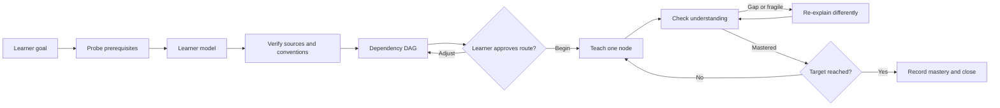

# omp-learn

A project-local, source-verified adaptive-learning workflow for [Oh My Pi (OMP)](https://github.com/can1357/oh-my-pi).

`omp-learn` measures the learner's prerequisite boundary, verifies the proposed route against authoritative sources, exposes the route as a dependency graph for approval, and then teaches one conceptual node at a time. Progress is recorded as demonstrated mastery in a durable Markdown lesson note.

This repository is an independent OMP adaptation of the workflow demonstrated in Eero Alvar's video, [How I Use AI to Learn Things](https://www.youtube.com/watch?v=kzcI5F4tGiU). See [Attribution](#attribution).

## What it provides

- An adaptive `teach` skill that probes before planning or teaching.
- One diagnostic question at a time through OMP's interactive `ask` surface.
- A `lesson-researcher` agent for definitions, conventions, prerequisite relations, and direct source URLs.
- A learner-approved Mermaid dependency DAG before teaching begins.
- One-node teaching followed by generation or application checks.
- Recalibration after wrong, guessed, or fragile answers instead of automatic forward progress.
- An optional `lesson-visualizer` agent that renders, inspects, and revises instructional SVGs.
- Structured Markdown notes containing learner evidence, sources, plans, lesson nodes, mastery status, and unresolved questions.

## Workflow



The full behavioral contract and verification checklist are in [OMP-PI-LEARNING-WORKFLOW.md](OMP-PI-LEARNING-WORKFLOW.md).

## Requirements

- OMP with project skill and agent discovery.
- An interactive OMP TUI session. The `ask` tool is unavailable in headless mode.
- A configured model and provider.
- Network access when lesson claims require external source verification.
- A browser-capable OMP setup only when an instructional SVG is generated and visually checked.

No global OMP modification, custom quiz extension, or Obsidian plugin is required.

## Quick start

Clone the repository and start OMP from it:

```bash
git clone https://github.com/jtyuill/omp-learn.git
cd omp-learn
omp
```

OMP discovers skills at startup. Restart an already-running session after installing or changing these files.

Invoke the skill with a concrete destination:

```text
/skill:teach Topic: Differential forms.
Goal: Build enough intuition and formal machinery to understand how Maxwell's four equations are expressed as two equations with differential forms.
Known: Comfortable with multivariable calculus, line and surface integrals, divergence, curl, and ordinary Stokes' theorem; little relativity.
Style: Mixed.
Note: learning/differential-forms.md
```

A shorter invocation also works, but the probe still tests load-bearing claims about prior knowledge:

```text
/skill:teach Give me a solid introduction to differential forms, ending at Maxwell's equations. I know vector calculus but not differential forms.
```

## Install into an existing workspace or Obsidian vault

Copy the project definitions into the workspace that should own the workflow:

```bash
WORKSPACE=/absolute/path/to/workspace
mkdir -p "$WORKSPACE/.omp/agents" "$WORKSPACE/.omp/skills"
cp .omp/agents/lesson-researcher.md "$WORKSPACE/.omp/agents/"
cp .omp/agents/lesson-visualizer.md "$WORKSPACE/.omp/agents/"
cp -R .omp/skills/teach "$WORKSPACE/.omp/skills/"
mkdir -p "$WORKSPACE/learning/assets"
cd "$WORKSPACE"
omp
```

To share one installation across multiple vaults, place `.omp` in their common ancestor:

```text
~/Notes/
├── .omp/
│   ├── agents/
│   │   ├── lesson-researcher.md
│   │   └── lesson-visualizer.md
│   └── skills/
│       └── teach/
│           └── SKILL.md
├── CS/College/
└── Learn/Learn/
```

Starting OMP from either descendant vault discovers the shared definitions. Lesson notes and assets remain relative to the directory from which OMP was started unless the invocation supplies an explicit `Note` path. A nearer project definition with the same name overrides the shared definition.

## Repository layout

```text
.
├── .omp/
│   ├── agents/
│   │   ├── lesson-researcher.md
│   │   └── lesson-visualizer.md
│   └── skills/
│       └── teach/
│           └── SKILL.md
├── learning/
│   └── assets/
├── OMP-PI-LEARNING-WORKFLOW.md
└── README.md
```

### `teach`

Owns the learner model, probe, route design, approval gate, teaching loop, mastery checks, and durable lesson note.

### `lesson-researcher`

Read-only source-verification agent. It audits the candidate route and returns canonical formulations, prerequisite corrections, direct URLs, and residual uncertainty. It does not design the lesson.

### `lesson-visualizer`

Creates one pedagogically necessary SVG for one lesson node. It must render the SVG, inspect the rendered result, correct visible defects, and inspect it again before returning the asset.

## Durable lesson artifact

By default, a lesson is written to:

```text
learning/<topic-slug>.md
```

Assets are written under:

```text
learning/assets/<topic-slug>/
```

Existing notes are never overwritten. A new dated session section is appended while prior learner evidence is preserved. The note tracks:

- the exact goal;
- measured strengths, fragile concepts, gaps, and unprobed prerequisites;
- verified sources and conventions;
- the approved dependency route;
- completed teaching nodes and examples;
- learner responses and mastery evidence;
- remaining uncertainty and the next node.

The note can be opened directly in Obsidian; no Obsidian plugin is required.

## Deliberate differences from the video

- OMP's built-in `ask` tool replaces the Pi quiz extension.
- The skill maintains a structured lesson note instead of mirroring the complete session through `md-log.ts`.
- Research and SVG work use project-local OMP agents.
- Visuals are generated only when they materially improve the reasoning step.
- Model identifiers are not hard-coded; agents inherit the active/default OMP model.

These are implementation substitutions. The learning contract remains: measure, verify, expose and approve dependencies, teach one step, check understanding, recalibrate, and persist evidence.

## Attribution

The original workflow demonstration and teaching process come from Eero Alvar's video, [How I Use AI to Learn Things](https://www.youtube.com/watch?v=kzcI5F4tGiU).

This repository is an independent adaptation based on the video's observable behavior. It is not affiliated with or endorsed by Eero Alvar or the Pi project. The video's custom Pi files, including `md-log.ts`, are not copied. Downloaded video, captions, and review frames used during analysis are excluded from this repository.
